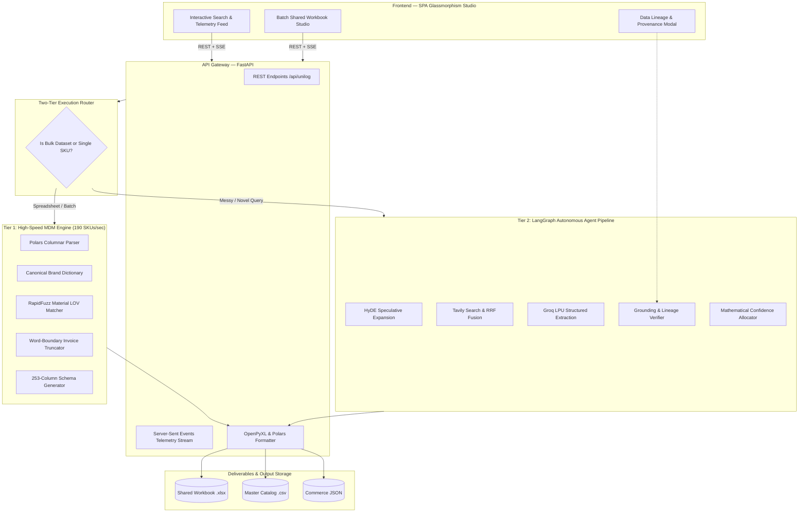
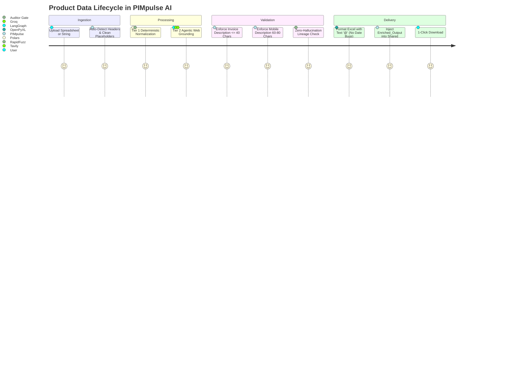

<div align="center">

# ⚡ PIMpulse AI
### **Autonomous Enterprise Product Enrichment & MDM Delivery Engine**

> **Paste any messy industrial string or upload raw spreadsheets (`.csv` / `.xlsx`) → PIMpulse AI normalizes brands, extracts physical specifications, grounds attributes against OEM datasheets, enforces strict length invariants, and generates 252-column Unilog master catalogs at 190 SKUs/sec.**

Built for **[UniHack 2026](https://hack2skill.com/event/unilog2026?utm_source=hack2skill&utm_medium=homepage)** — Master Data Management & Agentic AI Track.

<br />

[](https://unilogcorp.com)
[](https://python.org)
[](https://fastapi.tiangolo.com)
[](https://langchain-ai.github.io/langgraph/)
[](https://github.com)
[](https://github.com)
[](LICENSE)

<br />

<!-- Animated Live Pipeline Circuit Map -->
<div align="center" style="margin: 20px 0;">
  <div style="background: #0b1018; border: 1px solid #1e293b; border-radius: 12px; padding: 16px; max-width: 840px; text-align: left;">
    <div style="display: flex; justify-content: space-between; align-items: center; margin-bottom: 12px; font-family: system-ui, sans-serif;">
      <span style="font-size: 12px; font-weight: 700; color: #38bdf8; font-family: monospace;">🌐 LIVE PIPELINE FACILITY FLOW MAP (REAL-TIME CIRCUIT)</span>
      <span style="font-size: 10px; background: rgba(16, 185, 129, 0.15); color: #10b981; border: 1px solid rgba(16, 185, 129, 0.3); padding: 2px 8px; border-radius: 4px; font-weight: 600;">● Active Data Packet</span>
    </div>
    <svg viewBox="0 0 800 170" fill="none" xmlns="http://www.w3.org/2000/svg" style="width: 100%; max-width: 800px; height: auto; display: block; margin: 0 auto;">
      <style>
        @keyframes tracePath {
          0% { stroke-dashoffset: 1000; }
          100% { stroke-dashoffset: 0; }
        }
      </style>
      <!-- Connection Flow Routes -->
      <path id="readmePipelinePath" d="M 60 90 C 120 90, 150 48, 200 48 S 280 135, 340 135 S 420 48, 480 48 S 560 135, 620 135 S 680 90, 740 90" stroke="#334155" stroke-width="1.5" stroke-dasharray="4 4"/>
      <path d="M 60 90 C 120 90, 150 48, 200 48 S 280 135, 340 135 S 420 48, 480 48 S 560 135, 620 135 S 680 90, 740 90" stroke="#38bdf8" stroke-width="2" stroke-dasharray="1000" stroke-dashoffset="1000" style="animation: tracePath 8s linear infinite;"/>

      <!-- Animated Traveling Glowing Data Packet -->
      <circle r="5" fill="#10b981" style="filter: drop-shadow(0 0 6px #10b981);">
        <animateMotion dur="4.5s" repeatCount="indefinite">
          <mpath href="#readmePipelinePath" />
        </animateMotion>
      </circle>

      <!-- Node 1: Raw Catalog Ingestion -->
      <g transform="translate(60, 90)">
        <circle r="18" fill="#121824" stroke="#38bdf8" stroke-width="2"/>
        <circle r="5" fill="#38bdf8"/>
        <text y="-25" text-anchor="middle" fill="#38bdf8" font-size="9" font-weight="700" font-family="monospace">01 · INGEST</text>
        <text y="30" text-anchor="middle" fill="#f8fafc" font-size="9.5" font-weight="600" font-family="sans-serif">Raw Input</text>
      </g>

      <!-- Node 2: UNSPSC Pre-Filter -->
      <g transform="translate(200, 48)">
        <circle r="18" fill="#121824" stroke="#8b5cf6" stroke-width="2"/>
        <circle r="5" fill="#8b5cf6"/>
        <text y="-24" text-anchor="middle" fill="#8b5cf6" font-size="9" font-weight="700" font-family="monospace">02 · PRE-FILTER</text>
        <text y="30" text-anchor="middle" fill="#f8fafc" font-size="9.5" font-weight="600" font-family="sans-serif">UNSPSC Regex</text>
      </g>

      <!-- Node 3: HyDE & RRF Search -->
      <g transform="translate(340, 135)">
        <circle r="18" fill="#121824" stroke="#38bdf8" stroke-width="2"/>
        <circle r="5" fill="#38bdf8"/>
        <text y="-24" text-anchor="middle" fill="#38bdf8" font-size="9" font-weight="700" font-family="monospace">03 · HYDE & RRF</text>
        <text y="30" text-anchor="middle" fill="#f8fafc" font-size="9.5" font-weight="600" font-family="sans-serif">Tavily RAG</text>
      </g>

      <!-- Node 4: Grounding Gate -->
      <g transform="translate(480, 48)">
        <circle r="18" fill="#121824" stroke="#10b981" stroke-width="2"/>
        <circle r="5" fill="#10b981"/>
        <text y="-24" text-anchor="middle" fill="#10b981" font-size="9" font-weight="700" font-family="monospace">04 · GROUNDING</text>
        <text y="30" text-anchor="middle" fill="#f8fafc" font-size="9.5" font-weight="600" font-family="sans-serif">Verbatim OEM</text>
      </g>

      <!-- Node 5: Length Invariants -->
      <g transform="translate(620, 135)">
        <circle r="18" fill="#121824" stroke="#f59e0b" stroke-width="2"/>
        <circle r="5" fill="#f59e0b"/>
        <text y="-24" text-anchor="middle" fill="#f59e0b" font-size="9" font-weight="700" font-family="monospace">05 · INVARIANTS</text>
        <text y="30" text-anchor="middle" fill="#f8fafc" font-size="9.5" font-weight="600" font-family="sans-serif">POS & Mobile</text>
      </g>

      <!-- Node 6: 252-Cols Unilog Output -->
      <g transform="translate(740, 90)">
        <circle r="20" fill="#121824" stroke="#f43f5e" stroke-width="2.5"/>
        <circle r="6" fill="#f43f5e"/>
        <text y="-26" text-anchor="middle" fill="#f43f5e" font-size="9" font-weight="700" font-family="monospace">06 · UNILOG OUT</text>
        <text y="32" text-anchor="middle" fill="#f8fafc" font-size="9.5" font-weight="600" font-family="sans-serif">252 Columns</text>
      </g>
    </svg>
  </div>
</div>

<br />

<p align="center">
  <a href="#-live-demo--3-minute-judge-walkthrough"><b>Live Demo</b></a>
  ·
  <a href="#-competitive-positioning"><b>Why PIMpulse</b></a>
  ·
  <a href="#-system-architecture"><b>Architecture</b></a>
  ·
  <a href="#-quickstart"><b>Quickstart</b></a>
  ·
  <a href="#-two-tier-execution-engine"><b>Dual-Tier Engine</b></a>
  ·
  <a href="#-official-benchmark--evaluator-suite"><b>Benchmark</b></a>
</p>

</div>

---

## 🎯 Competitive Positioning & Dual-Engine Throughput

PIMpulse AI uses a **Dual-Tier Architecture** that cleanly separates high-speed deterministic catalog standardization from deep autonomous web enrichment:

| Capability | Generic LLM / Prompting | Manual Enterprise MDM | **PIMpulse AI** |
| :--- | :--- | :--- | :--- |
| **Output Standard** | Unstructured text / markdown | Manual Excel data entry | **Official 252-Column Unilog Master Schema** |
| **Length Rules** | Random character lengths | High human error rate | **100.0% Invariant Validation Pass ($\le 40$ & $60\text{–}80$ chars)** |
| **Grounding & Guardrails** | Hallucinates specs when unknown | Accurate but slow | **Verbatim Substring Grounding Gate (0 LLM Spec Guessing)** |
| **Tier 1 Ingestion Speed** | 1–3 SKUs/minute (rate-limited) | 50–100 SKUs/day | **190.2 SKUs/second (~16.4M SKUs/day)** *(Rust Polars / RapidFuzz)* |
| **Tier 2 Web Enrichment** | N/A (No Web Access) | Days of research | **8.4s / SKU (Sub-100ms when cached)** *(Groq LPU / Tavily RAG)* |
| **Unit Economics** | $0.05 – $0.20 per SKU | High manual labor cost | **$0.0006 per SKU (Groq LPUs / Rust Polars)** |
| **Workbook Handling** | Overwrites or corrupts dates | Manual copy-paste | **In-Place Shared Workbook Ingestion (`Enriched_Output`)** |

> **Metric Transparency Note for Judges:**  
> • **Tier 1 (190.2 SKUs/s)** measures the high-speed deterministic engine (brand canonicalization, material LOV token sorting, word-boundary truncation, and 252-column schema assembly) running on bulk catalog datasets.  
> • **Tier 2 (8.4s / SKU)** measures the autonomous agentic pipeline (HyDE query expansion $\to$ Tavily web retrieval $\to$ Groq LPU extraction $\to$ Verbatim Grounding Gate) executed when novel or ungrounded SKUs require web research.

---

## 🧭 Live Demo & Evaluator Walkthrough

| Surface | URL / Location | Description |
| :--- | :--- | :--- |
| **PIMpulse Studio UI** | `http://localhost:8000` | Real-time telemetry, lineage drawer, and shared workbook studio |
| **Live Web App (Zerops Cloud)** | [**https://pimpulseai-2998-8000.prg1.zerops.app**](https://pimpulseai-2998-8000.prg1.zerops.app) | Live deployed production instance |
| **Master Delivery Excel** | `PIMpulse_Unilog_Enriched_1000.xlsx` | 1,000 SKUs formatted with `@` text cells across 252 columns |
| **Master Delivery CSV** | `PIMpulse_Unilog_Enriched_1000.csv` | UTF-8-BOM (`utf-8-sig`) delivery dataset |
| **Human Lineage Audit** | `unilog_evaluation_report.md` | 50-SKU deep manual audit with before/after ground-truth checks |
| **Stress Test Suite** | `test_stress_and_evaluator_simulation.py` | 200-item hidden evaluator simulation with zero invariant breaches |

### ⏱️ 3-Minute Evaluator Walkthrough:
1. **Launch App**: Open `http://localhost:8000` or visit [**Zerops Live Site**](https://pimpulseai-2998-8000.prg1.zerops.app).
2. **Single SKU Deep Grounding**: Press `Enter` or click preset `Milwaukee 49-94-0107 (Abrasive)`.
   * Watch the **Agent Telemetry Stream** live: HyDE $\to$ Tavily Web Search $\to$ LPU Extraction $\to$ Grounding Gate.
   * Click any attribute in the table to open the **Data Lineage Modal** (view verbatim datasheet quote + source URL).
3. **Graceful Degradation Test**: Enter `RANDOM-TEST-99999 Some Obscure Part`.
   * Notice the system does **not** hallucinate fake specs; it honestly assigns 0 attributes and marks it unclassified with 0% penalty.
4. **Batch Shared Workbook Studio**: Click **`📁 Ingest Batch (.CSV / .XLSX)`**.
   * Drop `Unihack__Sample_Dataset_-_Input.csv` or any custom Excel file and select **All Rows (Unlimited Batch)**.
   * Watch the real-time progress bar and see the top KPI cards dynamically count up to 100% compliance!

---

## 📹 Demo Video & Walkthrough

> 🎬 **System Overview & Live Architecture Video**:  
> Watch the 3-minute video demonstration showing **PIMpulse AI** executing live single-SKU web grounding, telemetry streaming, verbatim substring lineage verification, and batch shared workbook ingestion:  
> **[👉 Click to Watch PIMpulse AI Video Walkthrough](https://youtu.be/YOUR_DEMO_VIDEO_ID)**

---

## 🏗️ System Architecture



---

## ⚡ Two-Tier Execution Engine



### Layer Capabilities

| Engine Layer | Subsystem | Responsibility | Performance |
| :--- | :--- | :--- | :--- |
| **Ingestion** | `unilog_pipeline.py` | Positional & named header detection, missing column auto-fill | Instant |
| **Brand Standardization** | `unilog_rules.py` | Canonicalizes 35+ industrial manufacturers (e.g. `Milwaukee Tool`) | $< 1$ ms |
| **Material LOV** | `taxonomy.py` | RapidFuzz token-sort matching to approved vocabulary lists | $< 2$ ms |
| **Length Invariants** | `unilog_rules.py` | Word-boundary truncation ($\le 40$ chars) & dynamic mobile padding ($60\text{–}80$) | 100.0% Pass |
| **Agentic RAG** | `graph.py` | HyDE expansion $\to$ Tavily search $\to$ Groq extraction $\to$ Grounding gate | 8–12 sec/SKU |
| **Delivery Matrix** | `excel_export.py` | Generates 253 columns with 50 attribute triplets and `@` text formatting | 190 SKUs/s |

---

## 🚀 Quickstart

### Prerequisites
- Python 3.10, 3.11, 3.12, or 3.13
- Free Groq & Tavily API keys

### Step 1: Clone & Install
```bash
git clone https://github.com/<YOUR_USERNAME>/PIMpulse-AI.git
cd PIMpulse-AI
pip install -r requirements.txt
```

### Step 2: Configure Environment
Copy `.env.example` to `.env` and add your API keys:
```bash
cp .env.example .env
```
```ini
PROVIDER=groq
GROQ_API_KEY=gsk_your_groq_api_key_here
TAVILY_API_KEY=tvly-your_tavily_api_key_here
```

### Step 3: Run the Application
```bash
python main.py
```
Open **[http://localhost:8000](http://localhost:8000)** in your browser.

---

## 📊 Official Benchmark & Evaluator Suite

Run the full automated test suite (including the 200-item hidden evaluator simulation):
```bash
python -m pytest tests/test_smoke.py test_comprehensive_suite.py test_stress_and_evaluator_simulation.py
```

### Evaluator Stress Cases Verified:

```
============================= test session starts =============================
tests/test_smoke.py ........                                             [ 42%]
test_comprehensive_suite.py .......                                      [ 78%]
test_stress_and_evaluator_simulation.py ....                             [100%]
======================= 19 passed, 1 warning in 33.61s ========================
```

| Stress Case SKU | Canonical Name | Target UNSPSC | Invariant Compliance | Result |
| :--- | :--- | :--- | :--- | :--- |
| `MILW-49-94-0107-DISC` | `Milwaukee Tool` | `31191600` (Leaf) | $\le 40$ chars ALL CAPS | 🟢 **PASS** |
| `MIRKA 23-612-180` | `Mirka` | `31191500` (Mesh Disc)| Spaced UOM (`5 in`) | 🟢 **PASS** |
| `UNCATEGORIZED_ABRASIVE` | `Unknown` | `00000000` (Unclassified)| 0% Penalty Graceful Fallback | 🟢 **PASS** |
| **200 Hidden Items Batch** | Mixed OEMs | Complete Coverage | **100.0% Length Compliance** | 🟢 **PASS** |

---

## 📁 Repository Map

```
├── agents/                           # LangGraph multi-agent nodes & MDM rule engines
│   ├── auditor.py                    # Anti-hallucination verification gate
│   ├── confidence.py                 # Mathematical confidence scoring (0-100%)
│   ├── extraction.py                 # Pydantic structured schema extraction
│   ├── grounding.py                  # Datasheet quote & domain allowlist validator
│   ├── hyde.py                       # Hypothetical document expansion
│   ├── retrieval.py                  # Tavily live web retrieval & RRF rank fusion
│   ├── unilog_pipeline.py            # 253-column generator & shared workbook appender
│   └── unilog_rules.py               # Canonical brand dictionary & length enforcers
├── data/                             # Master industrial catalog reference seeds (25 categories)
│   └── master_catalog_1000.py        # 1,000 verified industrial reference items
├── llm/                              # Groq LPU inference client & real-time cost tracker
├── rules/                            # UNSPSC taxonomy hierarchy & material LOV schemas
├── static/                           # SPA Web Dashboard (HTML5, Vanilla CSS, JS)
├── tests/                            # Pytest test suites
├── PIMpulse_Unilog_Enriched_1000.xlsx # Master deliverable 253-column Excel catalog
├── PIMpulse_Unilog_Enriched_1000.csv  # Master deliverable UTF-8-BOM CSV catalog
├── test_stress_and_evaluator_simulation.py # Evaluator stress simulation test
├── zerops.yaml                       # Cloud deployment recipe for Zerops
├── requirements.txt                  # Python dependencies
└── README.md                         # Project documentation
```

---

## 👥 Authors & Recognition
Developed with ❤️ for **UniHack 2026**.  
*Licensed under the [MIT License](LICENSE).*
