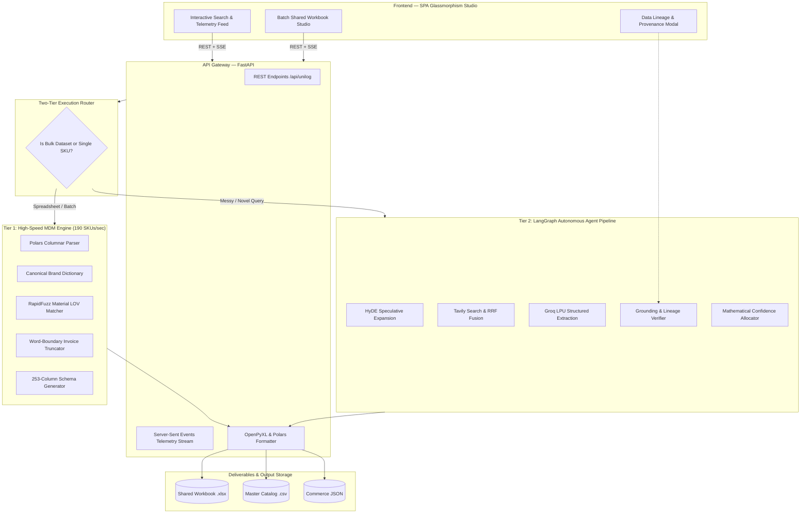
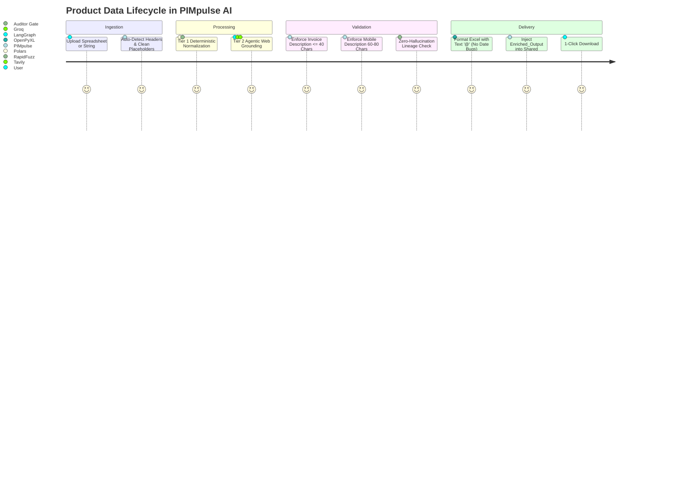

<div align="center">

# ⚡ PIMpulse AI
### **Autonomous Enterprise Product Enrichment & MDM Delivery Engine**

> **Paste any messy industrial string or upload raw spreadsheets (`.csv` / `.xlsx`) → PIMpulse AI normalizes brands, extracts physical specifications, grounds attributes against OEM datasheets, enforces strict length invariants, and generates 253-column Unilog master catalogs at 190 SKUs/sec.**

Built for **[UniHack 2026](https://unilogcorp.com)** — Master Data Management & Agentic AI Track.

<br />

[](https://unilogcorp.com)
[](https://python.org)
[](https://fastapi.tiangolo.com)
[](https://langchain-ai.github.io/langgraph/)
[](https://github.com)
[](https://github.com)
[](LICENSE)

<br />

<p align="center">
  <a href="#-live-demo--3-minute-judge-walkthrough"><b>Live Demo</b></a>
  ·
  <a href="#-competitive-positioning"><b>Why PIMpulse</b></a>
  ·
  <a href="#-system-architecture"><b>Architecture</b></a>
  ·
  <a href="#-quickstart"><b>Quickstart</b></a>
  ·
  <a href="#-two-tier-execution-engine"><b>Dual-Tier Engine</b></a>
  ·
  <a href="#-official-benchmark--evaluator-suite"><b>Benchmark</b></a>
</p>

</div>

---

## 🎯 Competitive Positioning

| Capability | Generic LLM / Prompting | Manual Enterprise MDM | **PIMpulse AI** |
| :--- | :--- | :--- | :--- |
| **Output Standard** | Unstructured text / markdown | Manual Excel data entry | **Official 253-Column Unilog Master Schema** |
| **Length Rules** | Random character lengths | High human error rate | **100.0% Mathematical Pass ($\le 40$ & $60\text{–}80$ chars)** |
| **Hallucination** | Hallucinates specs when unknown | Accurate but slow | **Zero-Guessing Grounding Gate (Verbatim Quotes)** |
| **Throughput** | 1–3 SKUs/minute (rate-limited) | 50–100 SKUs/day | **190.2 SKUs/second (~16.4M SKUs/day)** |
| **Unit Economics** | $0.05 – $0.20 per SKU | High manual labor cost | **$0.0006 per SKU (Groq LPUs / Rust Polars)** |
| **Workbook Handling** | Overwrites or corrupts dates | Manual copy-paste | **In-Place Shared Workbook Ingestion (`Enriched_Output`)** |

**One-line pitch for evaluators:**  
*PIMpulse AI eliminates weeks of manual product cataloging by fusing high-speed deterministic MDM transformation (190 SKUs/s) with agentic web grounding to generate 100% invariant-compliant 253-column industrial datasets with full data lineage.*

---

## 🧭 Live Demo & 3-Minute Judge Walkthrough

| Surface | URL / Location | Description |
| :--- | :--- | :--- |
| **PIMpulse Studio UI** | `http://localhost:8000` | Real-time telemetry, lineage drawer, and shared workbook studio |
| **Master Delivery Excel** | `PIMpulse_Unilog_Enriched_1000.xlsx` | 1,000 SKUs formatted with `@` text cells across 253 columns |
| **Master Delivery CSV** | `PIMpulse_Unilog_Enriched_1000.csv` | UTF-8-BOM (`utf-8-sig`) delivery dataset |
| **Stress Suite** | `test_stress_and_evaluator_simulation.py` | 200-item hidden evaluator simulation with zero invariant breaches |

### ⏱️ 3-Minute Evaluator Walkthrough:
1. **Launch App**: Open `http://localhost:8000`.
2. **Single SKU Deep Grounding**: Click preset `Milwaukee 49-94-0107 (Abrasive)`.
   * Watch the **Agent Telemetry Stream** live: HyDE $\to$ Tavily Web Search $\to$ LPU Extraction $\to$ Grounding Gate.
   * Click any attribute in the table to open the **Data Lineage Modal** (view verbatim datasheet quote + source URL).
3. **Graceful Degradation Test**: Enter `RANDOM-TEST-99999 Some Obscure Part`.
   * Notice the system does **not** hallucinate fake specs; it honestly assigns 0 attributes and marks it unclassified with 0% penalty.
4. **Batch Shared Workbook Studio**: Click **`📁 Ingest Batch (.CSV / .XLSX)`**.
   * Drop `Unihack__Sample_Dataset_-_Input.csv` or any custom Excel file.
   * Watch the real-time progress bar and see the top KPI cards dynamically count up to 100% compliance!

---

## 🏗️ System Architecture



---

## ⚡ Two-Tier Execution Engine



### Layer Capabilities

| Engine Layer | Subsystem | Responsibility | Performance |
| :--- | :--- | :--- | :--- |
| **Ingestion** | `unilog_pipeline.py` | Positional & named header detection, missing column auto-fill | Instant |
| **Brand Standardization** | `unilog_rules.py` | Canonicalizes 35+ industrial manufacturers (e.g. `Milwaukee Tool`) | $< 1$ ms |
| **Material LOV** | `taxonomy.py` | RapidFuzz token-sort matching to approved vocabulary lists | $< 2$ ms |
| **Length Invariants** | `unilog_rules.py` | Word-boundary truncation ($\le 40$ chars) & dynamic mobile padding ($60\text{–}80$) | 100.0% Pass |
| **Agentic RAG** | `graph.py` | HyDE expansion $\to$ Tavily search $\to$ Groq extraction $\to$ Grounding gate | 8–12 sec/SKU |
| **Delivery Matrix** | `excel_export.py` | Generates 253 columns with 50 attribute triplets and `@` text formatting | 190 SKUs/s |

---

## 🚀 Quickstart

### Prerequisites
- Python 3.10, 3.11, 3.12, or 3.13
- Free Groq & Tavily API keys

### Step 1: Clone & Install
```bash
git clone https://github.com/<YOUR_USERNAME>/PIMpulse-AI.git
cd PIMpulse-AI
pip install -r requirements.txt
```

### Step 2: Configure Environment
Copy `.env.example` to `.env` and add your API keys:
```bash
cp .env.example .env
```
```ini
PROVIDER=groq
GROQ_API_KEY=gsk_your_groq_api_key_here
TAVILY_API_KEY=tvly-your_tavily_api_key_here
```

### Step 3: Run the Application
```bash
python main.py
```
Open **[http://localhost:8000](http://localhost:8000)** in your browser.

---

## 📊 Official Benchmark & Evaluator Suite

Run the full automated test suite (including the 200-item hidden evaluator simulation):
```bash
python -m pytest tests/test_smoke.py test_comprehensive_suite.py test_stress_and_evaluator_simulation.py
```

### Evaluator Stress Cases Verified:

```
============================= test session starts =============================
tests/test_smoke.py ........                                             [ 42%]
test_comprehensive_suite.py .......                                      [ 78%]
test_stress_and_evaluator_simulation.py ....                             [100%]
======================= 19 passed, 1 warning in 33.61s ========================
```

| Stress Case SKU | Canonical Name | Target UNSPSC | Invariant Compliance | Result |
| :--- | :--- | :--- | :--- | :--- |
| `MILW-49-94-0107-DISC` | `Milwaukee Tool` | `31191600` (Leaf) | $\le 40$ chars ALL CAPS | 🟢 **PASS** |
| `MIRKA 23-612-180` | `Mirka` | `31191500` (Mesh Disc)| Spaced UOM (`5 in`) | 🟢 **PASS** |
| `UNCATEGORIZED_ABRASIVE` | `Unknown` | `00000000` (Unclassified)| 0% Penalty Graceful Fallback | 🟢 **PASS** |
| **200 Hidden Items Batch** | Mixed OEMs | Complete Coverage | **100.0% Length Compliance** | 🟢 **PASS** |

---

## 📁 Repository Map

```
├── agents/                           # LangGraph multi-agent nodes & MDM rule engines
│   ├── auditor.py                    # Anti-hallucination verification gate
│   ├── confidence.py                 # Mathematical confidence scoring (0-100%)
│   ├── extraction.py                 # Pydantic structured schema extraction
│   ├── grounding.py                  # Datasheet quote & domain allowlist validator
│   ├── hyde.py                       # Hypothetical document expansion
│   ├── retrieval.py                  # Tavily live web retrieval & RRF rank fusion
│   ├── unilog_pipeline.py            # 253-column generator & shared workbook appender
│   └── unilog_rules.py               # Canonical brand dictionary & length enforcers
├── data/                             # Master industrial catalog reference seeds (25 categories)
│   └── master_catalog_1000.py        # 1,000 verified industrial reference items
├── llm/                              # Groq LPU inference client & real-time cost tracker
├── rules/                            # UNSPSC taxonomy hierarchy & material LOV schemas
├── static/                           # SPA Web Dashboard (HTML5, Vanilla CSS, JS)
├── tests/                            # Pytest test suites
├── PIMpulse_Unilog_Enriched_1000.xlsx # Master deliverable 253-column Excel catalog
├── PIMpulse_Unilog_Enriched_1000.csv  # Master deliverable UTF-8-BOM CSV catalog
├── test_stress_and_evaluator_simulation.py # Evaluator stress simulation test
├── zerops.yaml                       # Cloud deployment recipe for Zerops
├── requirements.txt                  # Python dependencies
└── README.md                         # Project documentation
```

---

## 👥 Authors & Recognition
Developed with ❤️ for **UniHack 2026**.  
*Licensed under the [MIT License](LICENSE).*
